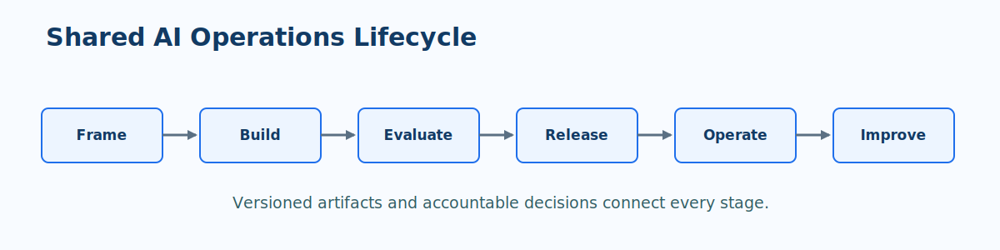
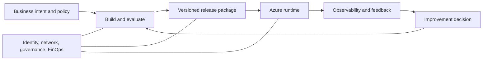

# Operating Model Foundations

MLOps and GenAIOps apply delivery and operational discipline to AI systems. They share a backbone: versioned inputs, explicit evaluation, controlled releases, monitoring, and learning from production. The artifacts differ, but the operating model is deliberately consistent.

!!! note "Start with the decision being improved"
    Define the business decision, users, permitted use, unacceptable outcomes, and expected value before choosing a model, prompt pattern, or deployment architecture.

> **Foundation principle:** A reproducible AI outcome requires traceable inputs, implementation, configuration, evaluation, and delivery evidence.

## Shared lifecycle

| Stage | Essential question | Core artifact |
| --- | --- | --- |
| Frame | What outcome is allowed and valuable? | Use-case brief, risk assessment, success measures |
| Build | What versioned inputs and implementation create the behavior? | Data or knowledge assets, code, prompts, environments |
| Evaluate | Does it meet quality, safety, and business thresholds? | Evaluation set, metrics, release report |
| Release | How is change promoted and reversed? | Versioned package, approval record, rollout plan |
| Operate | Is the service healthy and behaving as intended? | Dashboards, alerts, runbooks, ownership model |
| Improve | What evidence justifies the next change? | Backlog, feedback analysis, new candidate version |

## What changes between MLOps and GenAIOps

| Concern | MLOps | GenAIOps |
| --- | --- | --- |
| Primary behavior | A trained model produces a prediction or score | An application combines instructions, model calls, context, and tools |
| Main input lineage | Training data, feature definition, code, environment | Prompt, model deployment, retrieval corpus, tool configuration, code |
| Evaluation emphasis | Predictive quality, calibration, fairness, robustness | Task quality, grounding, safety, relevance, tool behavior, cost and latency |
| Improvement loop | New data, features, training, or model selection | Prompt, retrieval, orchestration, model selection, fine-tuning, or policy changes |

!!! tip "Keep one change record"
    A release record should name every material behavior input. For ML, this includes data and model lineage. For GenAI, include system instructions, evaluation dataset, retrieval/index version, model deployment, safety configuration, and tool contracts.

## Roles and decision rights

| Role | Accountable for |
| --- | --- |
| Business owner | Intended outcome, acceptable error, human escalation, value metrics |
| Data or knowledge owner | Data quality, allowed use, retention, lineage, and refresh policy |
| AI engineering owner | Implementation, evaluation design, release package, and technical quality |
| Platform owner | Reusable Azure services, identity, network, observability, and deployment standards |
| Risk, security, or compliance owner | Controls, evidence expectations, high-risk approval, and incident coordination |
| Operations owner | Service health, runbooks, alerts, recovery, and stakeholder communication |

??? abstract "Minimum release evidence"
    Retain these artifacts for every material production change:

    - Source revision and deployment artifact identity.
    - Versioned data, knowledge, model, prompt, and configuration references.
    - Evaluation results segmented by meaningful slices or scenarios.
    - Security, policy, and dependency scan results.
    - Approval, rollout, rollback, and post-release verification evidence.

## Reference architecture responsibilities

The architecture can be simple for a single workload, but the responsibilities should remain visible. Do not treat a notebook, a prompt editor, or an endpoint as the system of record for production behavior.