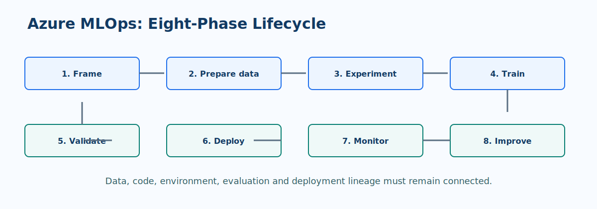

# Azure MLOps Lifecycle and Maturity

Azure MLOps operationalizes the path from a business problem to a monitored predictive model. The lifecycle combines data engineering, machine learning, software delivery, and governance so a model can be reproduced, evaluated, deployed, and improved with confidence.

!!! important "Maturity follows evidence, not tooling"
    A team does not become mature by adopting a service. It becomes mature when its operating practices are repeatable, measured, and appropriate to the impact of its workload.

> **MLOps principle:** Every production model should be traceable to the data, code, environment, evaluation, approval, and deployment that produced it.

## Five maturity levels

| Level | Operating state | Highest-value next capability |
| --- | --- | --- |
| 0. Manual | Notebook-led work, informal handoffs, weak reproducibility | Version source, data references, and experiments |
| 1. DevOps without ML controls | Application code has CI/CD but model work remains manual | Add experiment tracking and repeatable training |
| 2. Automated training | Parameterized training and registered model candidates | Add automated evaluation gates and lineage |
| 3. Automated deployment | Approved models promote through controlled environments | Add production monitoring and safe rollout patterns |
| 4. Full MLOps | Closed-loop monitoring, retraining, governance, and continuous improvement | Optimize reliability, cost, and portfolio reuse |

## Eight lifecycle phases

| Phase | Practices | Azure capabilities to consider |
| --- | --- | --- |
| 1. Frame | Define decision, KPI, harm, users, and acceptance criteria | Azure DevOps or GitHub issues, model card template |
| 2. Prepare data | Validate schema, leakage, quality, ownership, and versions | ADLS Gen2, Azure ML data assets, Data Factory, Databricks |
| 3. Experiment | Establish baselines, track runs, and pin environments | Azure ML jobs, MLflow, Azure ML environments |
| 4. Train | Build parameterized, reusable pipelines | Azure ML components, pipelines, compute clusters |
| 5. Validate | Test predictive quality, slices, robustness, and responsible AI | Azure ML evaluation, Responsible AI dashboard, Fairlearn |
| 6. Deploy | Package and promote through staging to production | Managed online or batch endpoints, GitHub Actions |
| 7. Monitor | Measure operations, drift, and performance with ground truth | Azure Monitor, Application Insights, Azure ML monitoring |
| 8. Improve | Compare challengers, retrain, and retire safely | Schedules, Event Grid, model registry, CI/CD |

## Early lifecycle guardrails

### Frame the correct problem

Document the intended decision, the action taken after a prediction, the cost of incorrect outcomes, and who can override the result. A high offline score does not prove that a model improves the business process.

### Protect data integrity

Separate train, validation, and test data by time or entity when appropriate. Validate schema, null rates, ranges, class distribution, and freshness before the training pipeline proceeds. Use versioned data asset references so a training run can be reproduced.

### Make experimentation reproducible

Log parameters, metrics, artifacts, source revision, environment version, data asset version, and random seed. Keep exploratory notebooks useful, but move production logic into tested modules and pipeline components.

??? warning "Common maturity trap: automation without gates"
    Automated training is not safe by default. A pipeline should stop or require review when:

    - input data fails validation or differs materially from expectation;
    - the candidate does not outperform the chosen baseline or champion;
    - a critical evaluation slice falls below its threshold; or
    - lineage, environment, or evaluation evidence is incomplete.

## Maturity assessment prompts

1. Can an engineer recreate the deployed model from versioned inputs without searching through notebooks or shared drives?
2. Do promotion criteria include business and risk thresholds, not just one aggregate metric?
3. Is there a named owner for data drift, model degradation, endpoint health, and retraining decisions?
4. Can the team roll back traffic and reconcile predictions made during an incident?

Use the answers to select one achievable improvement. A reliable Level 2 pipeline is usually more valuable than a fragile attempt at fully autonomous retraining.