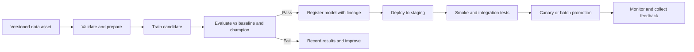

# Build, Deploy, and Monitor ML Systems

Production MLOps turns a validated candidate into a managed service without losing the ability to explain or reproduce its behavior. The core design is a sequence of explicit gates: validate inputs, train, evaluate, register, deploy safely, observe outcomes, and decide whether to improve or revert.

!!! note "Choose the serving pattern from the business clock"
    Use managed online endpoints when a caller needs a low-latency response. Use batch endpoints when predictions can be scheduled or processed asynchronously at scale. The delivery pattern should follow the decision deadline, not model novelty.

> **Release principle:** A registered model is a candidate. Production promotion requires evidence that it is safe, useful, supportable, and reversible.

## Pipeline contract

## Evaluation and registration gates

| Gate | What to verify | Evidence |
| --- | --- | --- |
| Reproducibility | Data, source, dependencies, and parameters are pinned | Run ID, Git SHA, environment and data versions |
| Predictive quality | Candidate meets metric and slice thresholds | Evaluation report with baseline/champion comparison |
| Responsible AI | Relevant fairness, explainability, and error analysis complete | Responsible AI artifact and risk decision |
| Operational fitness | Model package is compatible with serving contract and quota | Integration test, performance test, endpoint configuration |
| Release approval | Accountable owner accepts residual risk | Approval and change record |

!!! tip "Compare against a champion"
    A fixed threshold can hide regression when the current production model is already stronger. Evaluate every candidate against a stable baseline and the current champion using the same test population.

## Deployment patterns

| Pattern | Use when | Control to include |
| --- | --- | --- |
| Staging then production | All material changes | Automated smoke, contract, and latency tests before promotion |
| Canary | Online inference supports traffic splitting | Observe errors, latency, and outcome quality before increasing traffic |
| Blue/green | A clean environment switch is safer than mixed traffic | Maintain tested rollback to the prior deployment |
| Batch release | Scoring is asynchronous or high-volume | Validate output schema, record job lineage, reconcile consumers |

## Monitoring signals that matter

| Signal | Why it matters | Decision it supports |
| --- | --- | --- |
| Endpoint latency, errors, availability | Detects user-visible service degradation | Scale, investigate, or fail over |
| Data drift | Detects changed input distributions | Review data, feature logic, or retraining need |
| Prediction distribution | Detects changed outcome patterns | Investigate upstream behavior or model calibration |
| Ground-truth performance | Reveals true quality after labels arrive | Retrain, retire, or adjust workflow |
| Cost per prediction | Connects demand and architecture to spend | Optimize compute, serving pattern, or model |

??? info "Retraining decision guide"
    Treat retraining as a controlled release, not an automatic remedy. Consider a scheduled retraining cycle first, then add event-driven triggers only when data, labels, evaluation gates, and rollback procedures are trustworthy.

    - **Scheduled:** predictable domain change and stable label availability.
    - **Drift-based:** input or output shift is an early warning, requiring review before retraining.
    - **Performance-based:** ground truth confirms degradation below an accepted threshold.
    - **Event-based:** a schema, business process, policy, or data-source change invalidates assumptions.

## Operational readiness

Before production, verify that the team can locate a model version, identify its data and source lineage, view health and performance signals, roll back the deployment, and communicate a supported degradation mode. A model that cannot be operated safely is not production-ready.