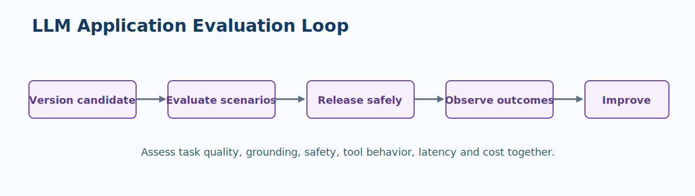
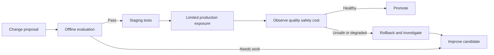

# Evaluate and Operate LLM Applications

An LLM application should be evaluated as a system. The model is only one component; its output can change when instructions, retrieval corpus, tool behavior, guardrails, deployment configuration, or user context change.

!!! warning "Do not use 'looks good' as a release gate"
    Human review is valuable, but it must be repeatable. Define scenarios, expected qualities, thresholds, reviewers, and the decision rule for ambiguous results.

> **Evaluation principle:** Measure quality, safety, latency, and cost against representative scenarios before and after every material behavior change.

## What to evaluate

| Dimension | Example question | Useful evidence |
| --- | --- | --- |
| Task quality | Does the response complete the intended task? | Correctness, relevance, task completion, rubric score |
| Grounding | Are claims supported by approved sources? | Citation quality, retrieval relevance, unsupported-claim rate |
| Safety | Does the application respect policy and resist misuse? | Content safety results, jailbreak and prompt-injection tests |
| Tool behavior | Are actions authorized, correct, and recoverable? | Tool-call accuracy, approval records, side-effect reconciliation |
| Experience | Is the response usable within the expected time? | Latency, abandonment, satisfaction, rephrase rate |
| Economics | Is the value proportionate to operating cost? | Tokens, model calls, retrieval cost, cost per successful task |

## Evaluation set design

Build a versioned set of realistic scenarios, not only ideal questions. Each item should state its purpose and expected characteristics so reviewers or automated evaluators can make a consistent judgment.

| Scenario class | Include | Why it matters |
| --- | --- | --- |
| Happy path | Frequent, high-value requests | Protects the common user journey |
| Edge case | Ambiguous, incomplete, or unusual inputs | Reveals fragile assumptions |
| Grounding challenge | Missing, conflicting, or stale source material | Tests whether the app declines or cites appropriately |
| Safety challenge | Disallowed requests and prompt-injection attempts | Validates defense layers and escalation |
| Tool challenge | Invalid arguments, unavailable dependency, duplicate request | Tests safe side effects and recovery |

??? example "Release evaluation workflow"
    1. Freeze the candidate configuration: application revision, prompt, model deployment, retrieval index, tool contracts, and safety settings.
    2. Run automated structural, safety, and task-quality checks over the versioned evaluation set.
    3. Review a risk-based sample with a defined rubric, including known difficult scenarios.
    4. Compare results to the production baseline or current champion, including latency and cost.
    5. Record the decision, residual risks, rollout plan, and rollback trigger.

## Production observability

Production telemetry must be useful without becoming a store of sensitive user content. Log correlation identifiers, model and application versions, timing, tokens, retrieval and tool outcomes, policy decisions, and sanitized quality signals. Apply access controls, retention, redaction, and sampling appropriate to the data classification.

| Signal | Investigation question | Typical response |
| --- | --- | --- |
| Quality decline | Which scenario, source, model, or version changed? | Contain rollout, inspect retrieval or prompt, evaluate candidate fixes |
| Higher refusal rate | Is policy behaving correctly or blocking valid work? | Segment by policy category and workflow, tune with risk owner |
| Grounding issue | Is the source missing, stale, or not retrieved? | Update corpus, index, ranking, or answer policy |
| Latency or cost spike | Which call, tool, or source drives the change? | Optimize routing, caching, prompt length, model choice, or quota |
| Unsafe tool action | Did authorization, validation, or approval fail? | Stop the action path, preserve evidence, investigate and reconcile |

## Progressive delivery

Use a staging environment and automated smoke tests before production. For material changes, expose a small eligible population first, observe pre-agreed metrics, and expand only when evidence supports it. Make rollback a tested operation, not a hopeful plan.

