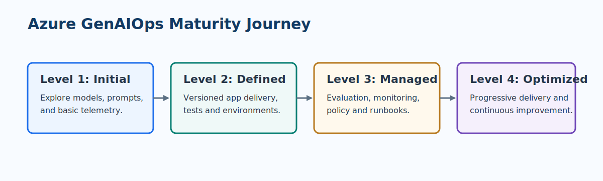

# Azure GenAIOps Maturity Journey

GenAIOps, often called LLMOps, applies operational discipline to applications built with large language models. It extends familiar MLOps practices because the deployed behavior is shaped by more than a trained model: prompts, retrieval knowledge, tools, model configuration, safety policies, and application code all matter.

!!! important "Maturity is workload-specific"
    Assess one LLM application and its operating evidence. A team can run one low-risk assistant at Level 2 while a regulated workflow needs selected Level 3 or Level 4 controls.

> **GenAIOps principle:** Version every material input to behavior: system instructions, model deployment, retrieval source, tool contract, safety policy, and application implementation.

## Four maturity levels

| Level | Operating state | What good looks like | Primary risk to address next |
| --- | --- | --- | --- |
| 1. Initial | Exploratory use of LLM APIs and prompts | Defined use case, basic prompt experiments, request telemetry | Unrepeatable behavior and unmeasured quality |
| 2. Defined | Structured development and delivery | Prompt and application versioning, test data, CI/CD, deployment environments | Release decisions based on informal review |
| 3. Managed | Measured production operations | Production monitoring, evaluation, alerting, compliance controls, runbooks | Manual analysis and slow improvement cycles |
| 4. Optimized | Evidence-led, continuously improving operations | Automated gates, progressive delivery, experimentation, portfolio optimization | Over-automation without human risk ownership |

## Level 1: Initial

Start with a bounded use case, an explicitly permitted audience, representative example inputs, and a simple feedback path. Compare models using task-relevant quality, latency, throughput, and cost rather than a general benchmark alone. Capture basic request volume, error rate, and response time without logging sensitive prompts or outputs indiscriminately.

## Level 2: Defined

Move prompts, orchestration, and evaluation data into source control. Introduce a repeatable environment path and automated tests. Define an evaluation set that includes common requests, edge cases, safety-sensitive cases, and known weak examples. Separate experiments from release candidates.

## Level 3: Managed

Add operational dashboards, structured event logging, alert ownership, and a regular review cadence. Evaluate quality and safety in production using privacy-aware sampling, user feedback, and ground-truth tasks where available. Enforce policy for identity, network access, secrets, data handling, and change approval.

## Level 4: Optimized

Use automated evaluation gates and progressive exposure to improve safely. Compare prompt, retrieval, model, and workflow candidates with clear success measures. Automate routine collection of evidence and use cost, quality, safety, and user outcomes together to prioritize improvement.

??? tip "A practical maturity move"
    Choose the smallest control that closes the most consequential gap.

    - Initial to Defined: create a versioned evaluation set and run it for every prompt or model change.
    - Defined to Managed: give quality and safety alerts named owners and a documented response path.
    - Managed to Optimized: use progressive delivery and repeatable evaluation gates instead of manual spot checks.

## Core GenAIOps artifacts

| Artifact | Why it exists | Minimum fields |
| --- | --- | --- |
| AI use-case record | Defines intended use and boundaries | Users, decision, harm, owner, prohibited uses |
| Prompt or flow package | Recreates application behavior | Instructions, templates, tool calls, source revision |
| Evaluation dataset | Makes quality comparable across changes | Scenario, input, expected traits, risk category |
| Configuration manifest | Pins runtime behavior | Model deployment, parameters, retrieval/index, safety settings |
| Release report | Records whether promotion is justified | Metrics, safety results, cost/latency, approver, rollback plan |

## MLOps and GenAIOps connection

GenAIOps is not a replacement for MLOps. It shares CI/CD, environment management, monitoring, governance, security, and FinOps practices. It adds special attention to non-deterministic output, prompt injection, grounding, retrieval changes, tool use, content safety, and user-facing quality.