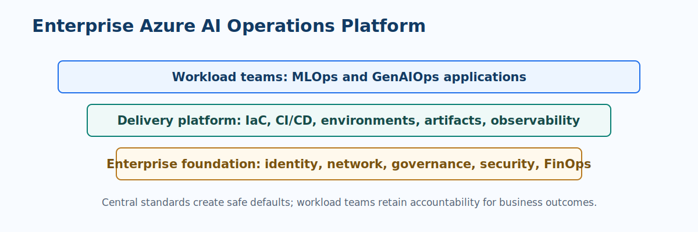

# Platform, Delivery, and FinOps

An enterprise AI platform makes the safe path the easy path. It provides reusable identity, networking, environment, observability, policy, deployment, and cost controls so delivery teams can focus on business outcomes rather than rebuilding foundations for each workload.

!!! important "Platform standards should enable delivery"
    A standard is useful when it gives teams a secure default, documented exception path, and measurable service outcome. A collection of controls that cannot be adopted will be bypassed.

> **Platform principle:** Standardize the controls and evidence that repeat; leave workload-specific business decisions with the accountable domain team.

## Platform capabilities

| Capability | Standardize centrally | Keep with workload teams |
| --- | --- | --- |
| Identity and network | Managed identities, RBAC patterns, private connectivity, DNS, policy | Which users and downstream systems need access |
| Environments | Subscription layout, naming, tagging, IaC modules, promotion path | Workload configuration and acceptance criteria |
| Delivery | CI/CD templates, secret handling, artifact retention, approvals | Test suites, release decisions, rollback conditions |
| Observability | Log schema, dashboards, alert routing, retention, correlation | Domain metrics, quality signals, runbook details |
| Governance | Required evidence, risk tiering, exception process | Risk assessment and business accountability |

## Delivery pipeline controls

| Stage | MLOps examples | GenAIOps examples | Minimum gate |
| --- | --- | --- | --- |
| Pull request | Unit tests, component contract tests | Prompt or flow linting, tool contract tests | Source review and secret scan |
| Build | Training component or inference image | Application, retrieval, and configuration package | Reproducible artifact |
| Evaluate | Quality, slice, fairness, robustness checks | Task, grounding, safety, and tool evaluations | Thresholds and evaluation evidence |
| Deploy | Staging endpoint or batch pipeline | Staging application or agent workflow | Smoke and integration tests |
| Promote | Canary or controlled batch release | Progressive exposure and rollback | Accountable approval when risk requires it |

??? info "Infrastructure as code baseline"
    Use versioned infrastructure definitions for resource creation and policy configuration. Protect state, use environment-specific values outside source control, and enforce tags such as environment, owner, workload, cost center, and data classification. Test infrastructure changes in lower environments before promotion.

## FinOps for AI workloads

AI cost requires a joint engineering and business view. Train or serve efficiently, but do not optimize away evaluation, security, observability, or human review without considering the operational risk created.

| Cost driver | MLOps lever | GenAIOps lever |
| --- | --- | --- |
| Compute | Scale training clusters to zero, use checkpointing and suitable SKUs | Right-size application compute, cache safe results, minimize idle capacity |
| Inference | Choose batch versus online serving, tune autoscaling | Route tasks to appropriate models, control tokens, cache retrieval or responses |
| Storage and telemetry | Lifecycle data, artifacts, and logs; control retention | Govern knowledge copies, traces, evaluation data, and content retention |
| People and exceptions | Improve data quality and review workflows | Improve retrieval, tool validation, prompts, and escalation design |

## Cost and value review cadence

- **Per release:** compare candidate quality, latency, safety, and cost to the current production baseline.
- **Weekly:** inspect usage, quota pressure, errors, and top cost contributors by workload.
- **Monthly:** reconcile spend to value, ownership, forecast, and optimization backlog.
- **Quarterly:** reassess service selection, reservation or capacity strategy, and portfolio standards.

!!! tip "Measure cost per successful outcome"
    Token cost or endpoint cost alone can mislead. Combine cost with the number of accepted predictions, completed user tasks, avoided rework, and human-review effort.