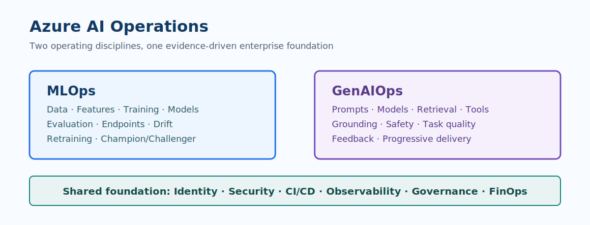

# Azure AI Operations

This learning guide brings together **Azure MLOps** for predictive machine learning and **Azure GenAIOps** for LLM applications. It is designed for teams moving beyond a promising experiment toward repeatable, secure, observable AI services.

!!! important "Operate outcomes, not models alone"
    A production AI system includes data, prompts or features, model and application versions, evaluation evidence, deployment controls, monitoring, and people accountable for decisions.

> **Operating principle:** MLOps and GenAIOps are lifecycle disciplines. Their goal is dependable business outcomes, not automated deployment for its own sake.

## What this site covers

| Learning area | MLOps focus | GenAIOps focus | Shared outcome |
| --- | --- | --- | --- |
| Build | Data assets, features, experiments, training | Prompts, retrieval, model selection, application flows | Reproducible change |
| Evaluate | Accuracy, calibration, fairness, slices | Quality, grounding, safety, task completion | Evidence before release |
| Deliver | Registered models and endpoints | Versioned app, prompt, retrieval, and model configuration | Controlled promotion |
| Observe | Drift, performance, latency, availability | Quality signals, safety events, cost, latency, user feedback | Early, actionable detection |
| Improve | Retraining and champion/challenger comparisons | Prompt, retrieval, model, and orchestration improvement | Measurable learning loop |

## Start here

1. Read [Operating Model](01-foundations/index.md) to understand the shared lifecycle, roles, and artifacts.
2. Use [Lifecycle and Maturity](02-mlops/lifecycle-and-maturity.md) for classical ML capability planning.
3. Use [Maturity Journey](03-genaiops/maturity-journey.md) for LLM application capability planning.
4. Apply [Governance and Security](04-enterprise/governance-and-security.md) before a workload handles sensitive data or makes consequential decisions.

??? info "A practical first assessment"
    Score one representative workload rather than evaluating the whole organization at once.

    - Can the team reproduce the currently deployed behavior from source, configuration, and versioned inputs?
    - Are release decisions based on recorded evaluation evidence rather than informal inspection?
    - Can operators identify an unsafe or degraded outcome, contain it, and recover safely?
    - Are cost, access, security, and ownership understood for the full workload path?

## Learning outcomes

After completing this guide, you should be able to:

- distinguish MLOps and GenAIOps operating concerns without building separate governance silos;
- define evidence-based maturity steps for an Azure AI workload;
- design evaluation gates, release paths, observability, and recovery practices; and
- establish enterprise controls that support safety, privacy, compliance, and sustainable cost.